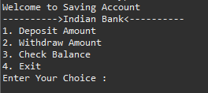
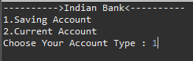
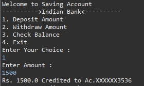
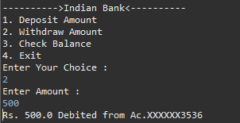
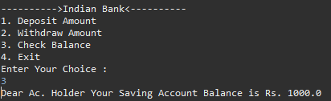
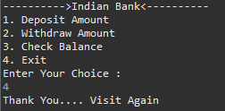

# 🏦 Bank Account Management System (Core Java)

A **console-based Bank Account Management System** developed using **Core Java** that simulates basic banking operations such as account selection, deposit, withdrawal, and balance inquiry. This project demonstrates the implementation of **Object-Oriented Programming (OOP)** concepts including **Abstraction, Inheritance, Encapsulation, and Interfaces**.

---

## 📌 Features

- 💰 Deposit Money
- 💸 Withdraw Money
- 📊 Check Account Balance
- 🏦 Savings & Current Account Support
- ✅ Minimum Balance Validation
- 📋 Interactive Menu-Driven Console
- 🔄 Continuous User Operations Until Exit

---

## 🛠️ Tech Stack

| Technology | Usage |
|------------|-------|
| Java | Core Programming Language |
| OOP | Abstraction, Inheritance, Interface, Encapsulation |
| Eclipse IDE | Development Environment |
| Git | Version Control |
| GitHub | Project Hosting |

---

## 📂 Project Structure

```
Bank Account Management System
│
├── Transactions (Interface)
│
├── BankAccount (Abstract Class)
│
├── AccountType (Concrete Class)
│
└── BankTransactions (Main Class)
```

---

## 🚀 Functionalities

### 1️⃣ Choose Account Type
- Savings Account
- Current Account

### 2️⃣ Deposit Amount
- Deposit money into the selected account.

### 3️⃣ Withdraw Amount
- Withdraw money with minimum balance validation.
- Savings Account Minimum Balance: ₹1000
- Current Account Minimum Balance: ₹5000

### 4️⃣ Check Balance
Displays the available account balance.

### 5️⃣ Exit
Terminates the application safely.

---

# 🧩 OOP Concepts Used

- ✅ Encapsulation
- ✅ Abstraction
- ✅ Inheritance
- ✅ Interface
- ✅ Method Overriding
- ✅ Polymorphism

---

# 📷 Screenshots

## Home Menu



---

## Select Account Type



---

## Deposit Money



---

## Withdraw Money



---

## Balance Enquiry



---

## Exit Screen



---

# 💻 Sample Output

```text
---------->Indian Bank<----------

1. Saving Account
2. Current Account

Choose Your Account Type : 1

Welcome to Saving Account

1. Deposit Amount
2. Withdraw Amount
3. Check Balance
4. Exit

Enter Your Choice : 1

Enter Amount : 5000

Rs. 5000 Credited to Ac.XXXXXX3536
```

---

# 📚 Concepts Covered

- Java Classes & Objects
- Abstract Class
- Interface
- Constructors
- Scanner Class
- Loops
- Switch Case
- Methods
- Conditional Statements
- Object-Oriented Programming

---

# 🔮 Future Enhancements

- User Login Authentication
- Multiple Customer Accounts
- Transaction History
- PIN Verification
- Fund Transfer
- Interest Calculation
- JDBC & MySQL Integration
- File Handling
- Exception Handling
- GUI using Java Swing/JavaFX

---

# 📈 Resume Highlights

- Developed a console-based Bank Account Management System using Core Java.
- Implemented OOP principles such as Abstraction, Inheritance, Encapsulation, and Interfaces.
- Designed modular architecture with reusable classes and transaction logic.
- Added account-wise minimum balance validation and interactive menu-driven operations.

---

# 👨‍💻 Author

**Atharva Golande**

📧 Email:atharvagolande04@gmail.com

🔗 LinkedIn: https://linkedin.com/in/atharva-golande-4b774a292

💻 GitHub: https://github.com/justatharva

---

## ⭐ If you like this project, don't forget to Star ⭐ the repository!
